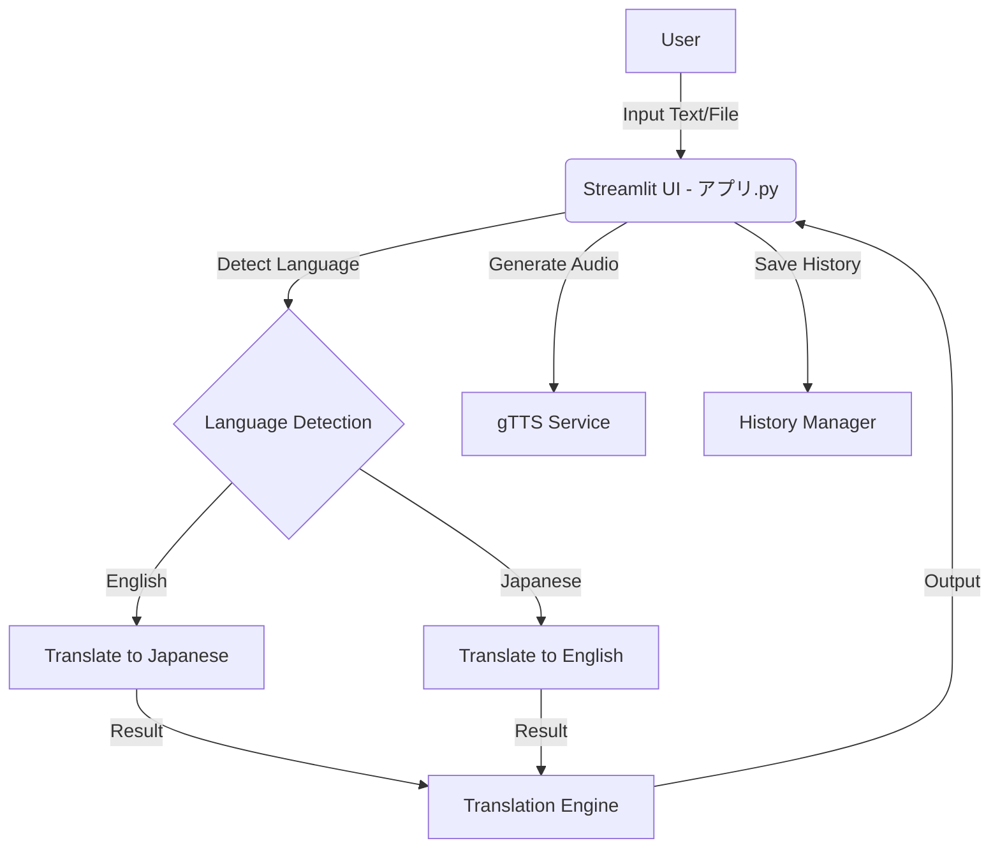

# 🚀 Nihongo Desu - Advanced Japanese Translation System


## 📖 概要 / Overview

**Nihongo Desu** は、英語と日本語間のシームレスな翻訳体験を提供する、Streamlit ベースの高度な翻訳アプリケーションです。

最新の翻訳エンジンと音声合成技術を組み合わせ、テキスト翻訳だけでなく、発音確認やファイル翻訳までサポートしています。学習者からプロフェッショナルまで、幅広いユーザーに使いやすいインターフェースを提供します。

**Nihongo Desu** is an advanced translation application built with Streamlit, offering a seamless translation experience between English and Japanese.
Combining modern translation engines with text-to-speech technology, it supports not just text translation but also pronunciation checks and file translation. Designed for everyone from learners to professionals.

---

## 🌟 主な機能 / Key Features

| Feature | Description |
|---------|-------------|
| **🔄 双方向翻訳 / Bidirectional** | 英語 ↔ 日本語の高精度な翻訳 (High-precision En↔Ja translation) |
| **🔍 自動検出 / Auto-Detection** | 入力テキストの言語を自動で判別 (Automatically detects input language) |
| **🗣️ 音声再生 / Text-to-Speech** | 翻訳結果をネイティブな発音で読み上げ (Native pronunciation playback) |
| **📂 ファイル翻訳 / File Support** | `.txt` ファイルをアップロードして一括翻訳 (Batch translate uploaded .txt files) |
| **📝 履歴機能 / History** | 直近の翻訳履歴を保存・参照可能 (Save and view recent translation history) |
| **📥 ダウンロード / Download** | 翻訳結果をテキストファイルとして保存 (Save translations as text files) |
| **🌙 ダークモード / Dark Mode** | 目に優しいダークテーマ標準搭載 (Eye-friendly dark theme included) |

---

## 🛠 インストール / Installation

### 前提条件 / Prerequisites
- Python 3.8 or higher
- Git

### 手順 / Steps

1. **リポジトリのクローン / Clone the repository**
   ```bash
   git clone https://github.com/yourusername/nihongo-desu.git
   cd nihongo-desu
   ```

2. **仮想環境の作成 (推奨) / Create Virtual Environment (Recommended)**
   ```bash
   python3 -m venv venv
   source venv/bin/activate  # Mac/Linux
   # venv\Scripts\activate   # Windows
   ```

3. **依存パッケージのインストール / Install Dependencies**
   ```bash
   pip install -r 要件.txt
   ```

---

## 🚀 使い方 / Usage

### アプリケーションの起動 / Start Application
```bash
streamlit run アプリ.py
```

ブラウザが自動的に開き、`http://localhost:8501` にアクセスします。
(The browser will open automatically at `http://localhost:8501`.)

### 翻訳手順 / How to Translate
1. **テキスト入力**: 左側のエリアに翻訳したい文章を入力、またはドラッグ＆ドロップで `.txt` ファイルをアップロードします。
2. **翻訳実行**: 「🚀 翻訳開始」ボタンをクリックします。
3. **結果確認**: 右側に翻訳結果が表示されます。
4. **音声・保存**: スピーカーアイコンで音声を再生、またはダウンロードボタンで結果を保存できます。

---

## 🏗 プロジェクト構成 / Architecture



- `アプリ.py`: メインアプリケーション (Main Entry Point)
- `機能/`: 音声合成、ファイル処理 (Features: Audio, File Processing)
- `翻訳/`: 翻訳ロジック、言語検出 (Translation Logic)
- `データ/`: 履歴、ログ保存 (Data & Logs)
- `設定/`: UIテーマ、言語設定 (Settings)

---

## 🐛 トラブルシューティング / Troubleshooting

| 問題 / Issue | 解決策 / Solution |
|--------------|-------------------|
| **翻訳エラー (Translation Error)** | インターネット接続を確認してください。APIのレート制限の可能性があります。 (Check internet connection. Possible rate limit.) |
| **音声が再生されない (No Audio)** | `gTTS` はインターネット接続が必要です。また、再生環境の音量を確認してください。 (Requires internet. Check system volume.) |
| **文字化け (Mojibake)** | アップロードするテキストファイルが `UTF-8` エンコーディングであることを確認してください。 (Ensure uploaded files are UTF-8.) |

---

## 🤝 貢献 / Contributing

Pull Request は大歓迎です！
1. Fork the project
2. Create your feature branch (`git checkout -b feature/AmazingFeature`)
3. Commit your changes (`git commit -m 'Add some AmazingFeature'`)
4. Push to the branch (`git push origin feature/AmazingFeature`)
5. Open a Pull Request

---

## 📄 ライセンス / License

This project is licensed under the **MIT License**.

---

## 🙏 謝辞 / Acknowledgments

- **Streamlit**: For the amazing app framework.
- **deep-translator**: For making translation easy.
- **gTTS**: For Google Text-to-Speech interface.

---
<div align="center">
  Made with ❤️ by Arron Kian Parejas
</div>
